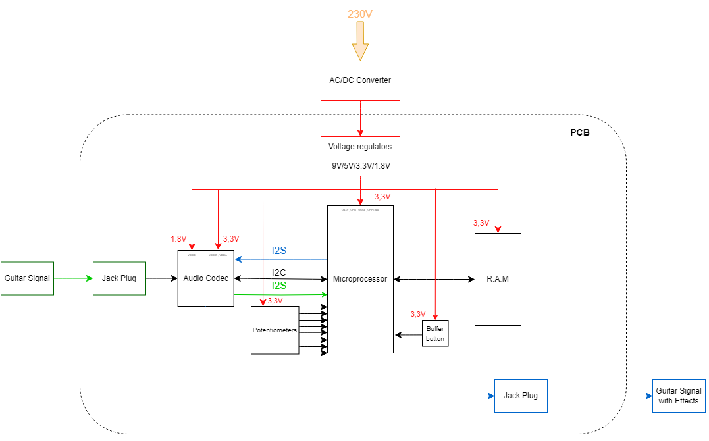

# Here you are in the Hardware Section
You will find all specifications and things to understand it.
Enjoy your reading ! (Camille L)

## 📖 Table of contents
1. [List of components](#list-of-components)
2. [Hardware Specifications](#hardware-specifications)
3. [Installation](#installation)

## List of components
- [Link to List of Components](https://github.com/lucacros/2324_Projet2A_PedaleGuitare/blob/Hardware-Section/List%20of%20Components.md)

For more details on each component, refer to [Hardware Specifications](#hardware-specifications).

# Hardware Specifications
## Block Diagram

  

Once the block diagram has been constructed, we can adapt it to the components used:

  

## Power supply
The power dissipated in the electronic component used in switching mode is lower than when used in linear mode. They are 2 types of power for this pedal. Power of digital components and for analog components. That's why we have, the objective is to obtain the cleanest power source for our analog components such as : DAC and ADC. 
    
|   Components   |   Voltages |  
|---    |:-:    |    
|   MicroProc   |   +3.3V   |   
|  Codec   |   VDDIO :+3.3V VDDD : +1.8V VDDA : +3.3V  |   
|   RAM   |   +3.3V   | 

To obtain these voltage levels, we use several voltage regulators. The first regulator is a switching regulator to go from 12V to 5V and then we use 2 linear regulators to obtain 3.3V and 1.8V. We first use a switching regulator to go from 12V to 5V, because switching regulators are more efficient than linear regulators when the voltage difference between input and output is high. We use linear regulators because they give a very clean output, with a minimum of noise.

### Switching power supply

The 17950x78 integrates both the input and output capacitors. Therefore, additional external input and output capacitors are normally not required.
The additional 100µF capacitor C1 is mounted as termination of the supply line and provides a slight damping of possible oscillations of the series resonance circuit represented by the inductance of the supply line and the input capacitance. This capacitor also prevents voltage overshoot during start up. the capacitor C3 allows fine tuning of load transcient voltage response.

### Linear power supplies
We use 3 linear regulators to lower the voltage to very clean outputs.

- 5V to 3.3V, for every components.

- 5V into 3.3VA, to supply the analog part.

- 3.3V to 1.8V, for the audio codec.

## Audio Codec 

The SGTL5000 is a digital-to-analog (DAC) and analog-to-digital (ADC) audio codec. Its basic operation involvesconverting analog signals to digital for audio input and converting digital audio signals to analog for audio output. The essential pins include those for I2S communication, power supply, mode selection, audio input and output connections, as well as control pins to configure the codec based on application requirements.
Using the microcontroller, we will control the I2C codec and transmit the signals in I2S.

  

### Power Section
To begin, we need to supply 2 different voltages: the first +3.3V to supply VDDA (for analogue part) and VDDIO (for Inputs/Outputs) and the second +1.8V to supply VDDD (for digital part).

|   Components   |   Voltages |  Description |
|---    |:-:    |:-    | 
|   VDDIO   |   +3.3V   | Power supply controls the digital I/O levels as well as the output level of LINE outputs. | 
| VDDD   |   +1.8V  | power supply controls the digital I/O levels as well as the output level of LINE outputs   |
|  VDDA  |   +3.3VA   | Power supply is used for the internal analog circuitry including ADC, DAC, LINE inputs, MIC inputs, headphone outputs and reference voltages.|

### Configuration
The codec is clocked at the same frequency as the microprocessor. It communicates via I2C  and transmits its audio data in I2S.

| Label names | Codec Pins name | Description |
|-------------|-----------------|-------------|
| **Guitar signal** | | 
| Ve_guitare_L | LINEIN_L | Left LINEIN | 
| Vs_guitare_L | LINEOUT_L | Left LINEOUT |
| Ve_guitare_R | LINEIN_R | Right LINEIN | 
| Vs_guitare_R | LINEOUT_R |Right LINEOUT |
| **Clock** | | 
| SYS_MCLK | SYS_MCLK | System master clock |
| **I2C** | | 
| SDA_I2S | CTRL_DATA | Mode: Serial Data |
| SCL_I2C | CTRL_CLK | Mode: Serial Clock |
| **I2S** | | 
| WS_I2S | I2S_LRCLK | Frame clock |
| CK_I2S | I2S_SCLK | Bit clock |
| DOUT_I2S | I2S_DOUT | Data output |
| SD_I2S | I2s_DIN | Data input |

## RAM 
For the granular effect, we need to store part of the sound that the guitar sends and read this sound. The RAM on the CPU was not enough to store all the information we needed, so we decided to use an external RAM.
To use the RAM we need to connect the Address pin to the CPU to send the information of which memory address we want to access in the RAM. The Data pin is used to send the information stored in the RAM to the CPU.
We have connected the RAM clock to the CPU clock so that the RAM and CPU work at the same speed.
## MicroProcessor 
The microprocessor is a crucial component in the guitar pedal system, responsible for controlling various functions, processing audio signals, and managing communication with other components. In this section, we'll delve into the specifications and details related to the microprocessor.
### MicroProcessor Pins
The microprocessor interacts with other components through various pins. Here are some essential pins and their functions:
### Power Supply Pins
|   Pins   |   Voltages |  
|---    |:-:    |    
|   VDDIO   |   +3.3V   |   
| VDDD   |   +1.8V  |   
|  VDDA  |   +3.3V   | 
### Communication with RAM
The STM32F446ZC communicates with the RAM to handle memory operations. RAM is crucial for storing and accessing data during signal processing.
### Communication with Audio Codec
The microprocessor communicates with the audio codec (SGTL5000) using I2C for control and I2S for audio data transmission. The codec is responsible for converting analog signals to digital and vice versa.
- [Link to the Routing table](https://github.com/lucacros/2324_Projet2A_PedaleGuitare/blob/Hardware-Section/Routing_Table.md)
## Connectors
### Jack connecting
We use Jack switched for the input and the output of the guitar. The switched Jack allow us to have the choice between a mono-input or a stereo input and a mono-output and a stereo-output. 
When we connect a jack to this connector, the pins SN and TN are disconnected from the pins S and T. It can allow to have 2 connectors to have stereo but still use the 2 input of the codec to have a signal as powerful as a stereo input.
## Buffer-Button
We use a buffer button to store a part of the sound of the guitar to apply several effects to it. It's one of the several options that offer the granular effect.
When the button is pressed, a signal is sent to the microprocessor. When it receives the signal, the microprocessor stores in the RAM the song it has received for a short time and continuously plays the part stored in the RAM.
## Potentiometers
We use several potentiometer for all the settings of our effects, the gain, the shape, the reverb ect... All potentiometers are fitted with capacitors to eliminate unwanted noise and high frequencies.
## 💻 Installation
I recommend downloading the latest version of **KiCad** to reproduce the electronic board. For simulating amplifiers, consider using **Cadence Pspice** or **Microcap**. Use the **STCUBEIDE** software for programming the codec and microprocessor.
- **Pspice**: [Download Pspice](https://www.cadence.com/en_US/home/tools/pcb-design-and-analysis/analog-mixed-signal-simulation/pspice.html)
- **KiCad**: [Download KiCad](https://www.kicad.org/)
- **STCUBEIDE**: [Download STCUBEIDE](https://www.st.com/en/development-tools/stm32cubeide.html)
