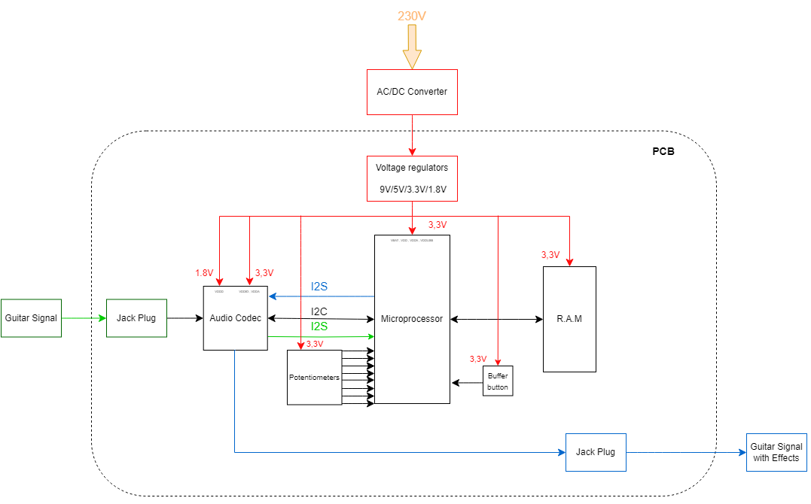
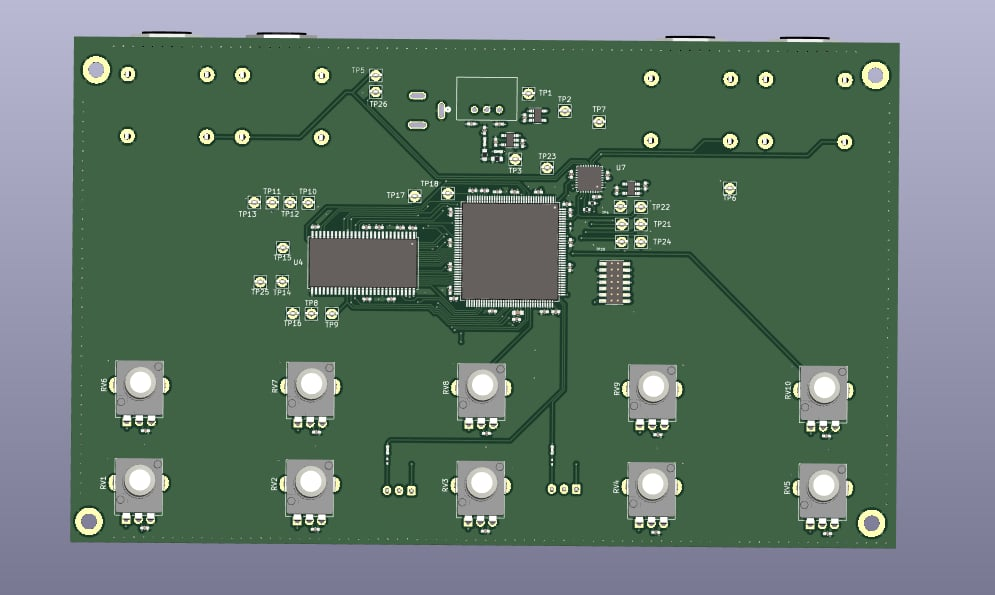
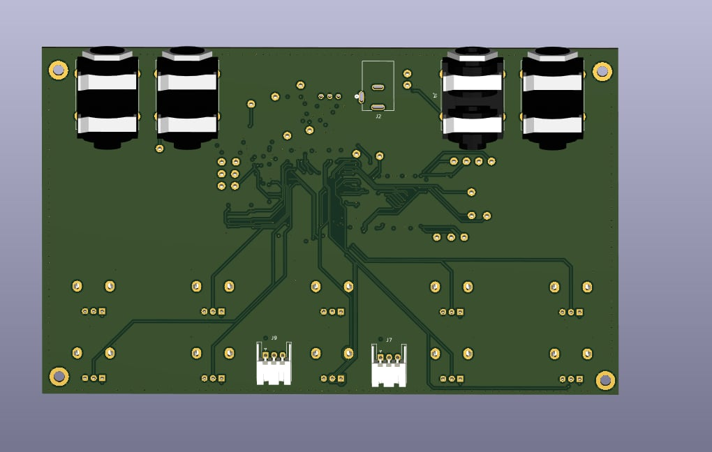
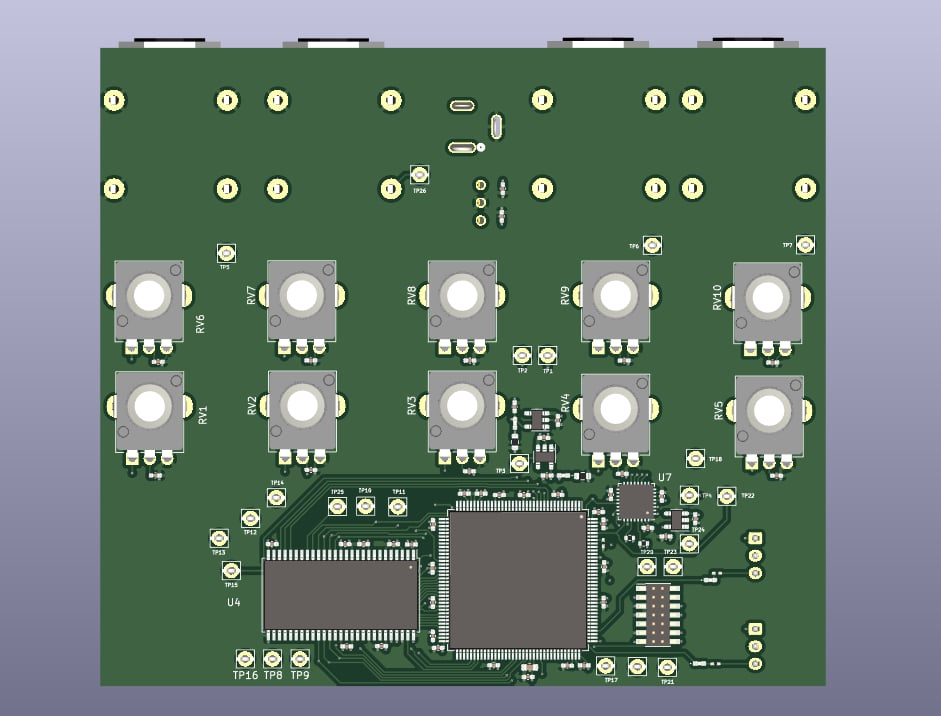
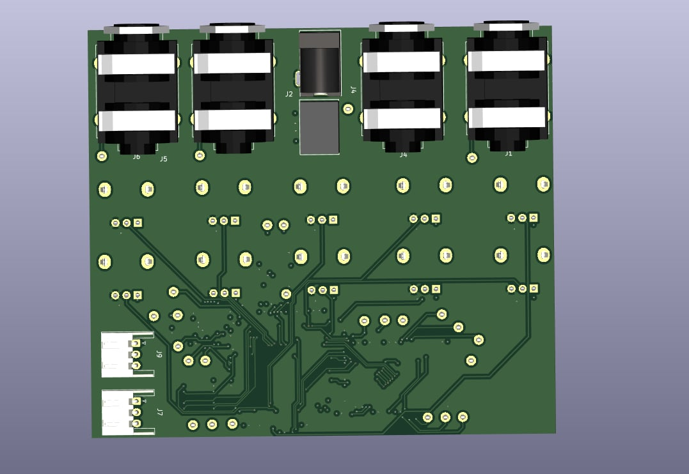

# Hi everyone 🖐️ & Welcome to our project: Multi-Effects Guitar Pedal 🎸🎛️

Hello music and technology fans! Welcome to the GitHub showcase for our multi-effects guitar pedal project. Here you'll find details, tools, and resources related to this exciting project. This is an academic project completed in 100 hours by the legendary trio: Luca CROSETTO, Jolan THOMASSET, and Camille LANFREDI

## 📖 Table of contents

- [📌 Présentation](#-présentation)
  - [📅 Management Section](#-management-section)
  - [🛠️ Hardware Section](#-hardware-section)
  - [💻 Software Section](#-software-section)
- [🚀 Contributions](#-contributions)
- [📜 Licence](#-licence)

## 📌 Présentation

Our multi-effects guitar pedal project aims to provide a versatile platform for guitarists, bringing together a variety of sound effects and audio processing tools in a single device. To achieve this, the guitar pedal will feature...

The project is divided into 3 parts: the first one is the project management, the second part is analog part, with the creation of the system's electronic board, and the third is the creation of the various digital audio effects. 
The second is the creation of the various digital audio effects.

## 📅 Management Section

In this section, you'll find everything to do with project management.

[Link to Management.md](Management.md)

## 🛠️ Hardware Section

 
 

 

### Power supply
To obtain these voltage levels, we use several voltage regulators. The first regulator is a switching regulator to go from 12V to 5V and then we use 2 linear regulators to obtain 3.3V and 1.8V. We first use a switching regulator to go from 12V to 5V, because switching regulators are more efficient than linear regulators when the voltage difference between input and output is high. We use linear regulators because they give a very clean output, with a minimum of noise.

We need to supply 2 different voltages: the first +3.3V to supply VDDA (for analogue part) and VDDIO (for Inputs/Outputs) and the second +1.8V to supply VDDD (for digital part).

|   Components   |   Voltages |  Description |
|---    |:-:    |:-    | 
|   VDDIO   |   +3.3V   | Power supply controls the digital I/O levels as well as the output level of LINE outputs. | 
| VDDD   |   +1.8V  | power supply controls the digital I/O levels as well as the output level of LINE outputs   |
|  VDDA  |   +3.3VA   | Power supply is used for the internal analog circuitry including ADC, DAC, LINE inputs, MIC inputs, headphone outputs and reference voltages.|

#### Jack connecting
We use Jack switched for the input and the output of the guitar. The switched Jack allow us to have the choice between a mono-input or a stereo input and a mono-output and a stereo-output. 
When we connect a jack to this connector, the pins SN and TN are disconnected from the pins S and T. It can allow to have 2 connectors to have stereo but still use the 2 input of the codec to have a signal as powerful as a stereo input.
#### Buffer-Button
We use a buffer button to store a part of the sound of the guitar to apply several effects to it. It's one of the several options that offer the granular effect.
When the button is pressed, a signal is sent to the microprocessor. When it receives the signal, the microprocessor stores in the RAM the song it has received for a short time and continuously plays the part stored in the RAM.
#### Potentiometers
We use several potentiometers for all the settings of our effects, the gain, the shape, the reverb ect... All potentiometers are fitted with capacitors to eliminate unwanted noise and high frequencies.

They are 2 versions of the pcb :
| V | Recto | Verso  |
|---|------|-------|
| V1.0| 
 
 | 
 
|
| V2.0| 
 
 | 
 
| 
| V3.0| wip  | wip| 

As you can see, the first version wasn't optimised. They is a lot of space between components and the design is not very good. That's why we did a new version witch to x2 smaller.

## 💻 Software Section

In this second part you will find everything that concerns the software part of the project. You'll find all the detailed audio effects programs and how they work.

[Link to Software Section](https://github.com/lucacros/2324_Projet2A_PedaleGuitare/tree/Software-Section)

## 🚀 Contributions

We would like to thank each person who helped us and provided support and information, such as:
- M. Nicolas PAPAZOGLOU
- M. Laurent FIACK
- M. Frédéric GERALDO

## 📜 Licence

The project is under the [SI TU VOLES T'ES MORT] license. Refer to the `LICENSE` file for more details.

---
Feel free to star this project (⭐) if you find it interesting!
